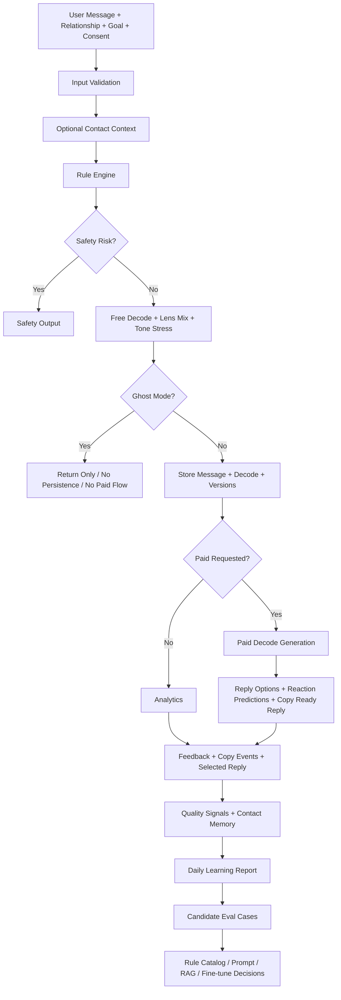
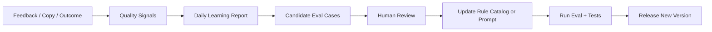

# مستند محصول و معماری هوش مصنوعی Message Decoder

آخرین بازبینی: 2026-05-24

این مستند توضیح می‌دهد بخش هوش مصنوعی Message Decoder چرا ساخته شده، چطور کار می‌کند، هر بلوک معماری چه مسئولیتی دارد، چه خروجی‌هایی باید بدهد و چطور قرار است هر روز بهتر شود. هدف این است که یک نفر جدید، بدون دانستن تاریخچه تصمیم‌ها، بتواند محصول و کد را بفهمد و با اطمینان روی آن کار کند.

## خلاصه محصول

Message Decoder یک ابزار فارسی‌زبان برای فهمیدن پیام‌های مبهم، سرد، تند، کنایه‌آمیز، احساسی یا کاری است. کاربر یک پیام را وارد می‌کند، نوع رابطه و هدف خودش را انتخاب می‌کند، و سیستم قبل از اینکه جواب پیشنهادی بسازد، پیام را از نظر نیاز پنهان، ریسک مکالمه و بهترین مسیر پاسخ تحلیل می‌کند.

وعده محصول:

> قبل از جواب دادن، بفهم پشت پیامش چیست و جواب کم‌ریسک‌تر بگیر.

محصول روی سه لنز رفتاری کار می‌کند:

- **لنز هدف و کنترل**: وقتی فشار اصلی روی نتیجه، زمان، پیگیری، خروجی یا کنترل شرایط است.
- **لنز امنیت و اعتماد**: وقتی فشار اصلی روی دیده‌شدن، اطمینان، نزدیکی، اعتماد یا ترس از طرد شدن است.
- **لنز شأن و احترام**: وقتی فشار اصلی روی احترام، جایگاه، آبرو، اعتبار، تحقیر یا دیده‌شدن سهم فرد است.

این لنزها تشخیص علمی یا پزشکی هورمون نیستند. آن‌ها فقط زبان محصول برای دسته‌بندی رفتاری پیام هستند.

## چرا فقط LLM کافی نیست؟

اگر همه کار را مستقیم به مدل بدهیم، چند مشکل پیش می‌آید:

- پاسخ‌ها گاهی ساده، تکراری یا بیش از حد عمومی می‌شوند.
- مدل ممکن است یک پیام خطرناک را مثل یک دعوای معمولی تحلیل کند.
- کنترل کیفیت سخت می‌شود، چون نمی‌دانیم چرا یک لنز یا لحن انتخاب شده است.
- هزینه بالا می‌رود، چون حتی تشخیص‌های ساده هم با مدل گران انجام می‌شود.
- هر بار تغییر پرامپت می‌تواند رفتار کل سیستم را غیرقابل پیش‌بینی کند.

برای همین معماری فعلی ترکیبی است:

- **Rule Engine** برای تشخیص سریع، قابل توضیح و ارزان.
- **Prompt + LLM** برای تولید متن طبیعی و متنوع.
- **Evaluation Suite** برای سنجش اینکه رول‌ها واقعاً بهتر شده‌اند یا فقط بزرگ‌تر.
- **Learning Loop** برای تبدیل فیدبک واقعی مردم به کیس‌های تست و بعداً دیتای RAG یا فاین‌تیون.

## معماری کلی

این جریان عمداً ساده نگه داشته شده است. سیستم فعلاً دیتای یادگیری را ذخیره و تحلیل می‌کند، اما خودش به شکل خودکار مدل یا رول‌ها را تغییر نمی‌دهد. تغییر واقعی باید با تست و review وارد شود.

## مسیر اصلی کاربر

### 1. ورودی کاربر

ورودی اصلی در `FreeDecodeIn` تعریف شده است:

- `message_text`: متن پیام طرف مقابل.
- `relationship_type`: نوع رابطه، مثل رابطه عاطفی، اکس، دوست، خانواده، همکار/مدیر، مشتری یا ناشناس.
- `user_goal`: هدف کاربر، مثل آرام کردن دعوا، مرزبندی، بهبود رابطه، پاسخ حرفه‌ای، مسئولیت‌خواهی، نیازمند به نظر نرسیدن، پایان مکالمه یا فقط فهمیدن.
- `optional_context`: توضیح اضافه اختیاری.
- `privacy_consent`: سطح رضایت کاربر برای ذخیره متن.
- `contact_id`: اتصال اختیاری تحلیل به یک مخاطب ذخیره‌شده.
- `ghost_mode`: تحلیل بدون ذخیره message و decode.

کد اصلی مسیر ورودی در این فایل است:

`apps/api/app/routers/decode.py`

اگر کاربر لاگین کرده باشد و `contact_id` معتبر بدهد، خلاصه رفتاری مخاطب (`profile_summary`) به context هوش مصنوعی اضافه می‌شود. این کار باعث می‌شود مدل paid و free فقط یک پیام جداافتاده را نبیند و از حافظه رابطه‌ای consentدار کاربر استفاده کند.

### 2. طبقه‌بندی با رول‌انجین

قبل از اینکه LLM وارد شود، `classify()` اجرا می‌شود. این بخش پیام را از چند زاویه بررسی می‌کند:

- آیا پیام high risk است؟
- آیا درخواست کاربر دستکاری‌گرانه است؟
- لنز غالب چیست؟
- لنزهای فرعی چیست؟
- لحن‌های محتمل چیست؟
- چه کلمات یا عبارت‌هایی evidence حساب شده‌اند؟
- confidence چقدر است؟

فایل‌های اصلی:

- `apps/api/app/services/rule_engine.py`
- `apps/api/app/services/rule_catalog.py`

رول‌انجین قلب قابل توضیح سیستم است. خروجی آن بعداً به پرامپت LLM هم داده می‌شود تا مدل از صفر حدس نزند.

### 3. Safety Mode

اگر پیام شامل نشانه‌های خطر باشد، مسیر عادی تولید جواب قطع می‌شود.

نمونه ریسک‌ها:

- خشونت یا تهدید فیزیکی
- خودآسیب‌رسانی
- اخاذی یا تهدید به افشا
- تعقیب یا درخواست لوکیشن
- تهدید جنسی
- اجبار و کنترل شدید
- ریسک حقوقی/کاری مثل تحریف سند یا فریب مشتری

در این حالت خروجی باید کوتاه، امن، غیرتحریک‌کننده و مرزدار باشد. سیستم نباید جواب عاشقانه، بازی روانی یا متن مذاکره با فرد تهدیدکننده بسازد.

هدف Safety Mode حفظ امنیت است، نه حفظ رابطه به هر قیمت.

### 4. Free Decode

Free Decode تحلیل پایه را به کاربر می‌دهد:

- لنز غالب
- توضیح لنز
- دلیل انتخاب لنز
- لنزهای فرعی
- نیاز پنهان احتمالی
- ریسک پاسخ اشتباه
- جهت پیشنهادی پاسخ
- confidence
- برداشت جایگزین
- هشدار حریم خصوصی اگر متن حساس باشد
- CTA برای گرفتن پاسخ آماده
- `lens_mix`: درصد تقریبی سهم سه لنز.
- `tone_stress`: برچسب و شدت لحن.

در نسخه رایگان، هدف تولید یک پاسخ کامل پولی نیست. هدف این است که کاربر بفهمد پشت پیام چیست و چرا باید نوع خاصی از جواب را انتخاب کند.

### 5. Paid Decode

Paid Decode روی ساخت جواب قابل ارسال تمرکز دارد.

خروجی پولی باید شامل این موارد باشد:

- تحلیل عمیق‌تر
- چند گزینه پاسخ با label متفاوت
- دلیل اثربخشی هر جواب
- کلمات ممنوع یا پرریسک
- safe opening line
- یک copy ready reply
- یک follow-up question
- reaction prediction برای هر گزینه پاسخ

گزینه‌ها باید متنوع باشند، نه سه نسخه شبیه هم. برای مثال:

- نرم
- کوتاه
- قاطع و آرام
- تعیین‌کننده مرز روابط
- حرفه‌ای
- هدف‌محور
- پایان‌دهنده

انتخاب labelها باید با نوع رابطه و هدف کاربر سازگار باشد.

## بلوک‌های معماری

## Rule Catalog

فایل:

`apps/api/app/services/rule_catalog.py`

این فایل دانش ساختاری سیستم است. در آن چند نوع داده نگهداری می‌شود:

- `LENS_RULES`: نشانه‌های قوی و ضعیف هر لنز.
- `TONE_RULES`: نشانه‌های لحن‌ها.
- `SAFETY_RULES`: نشانه‌های خطر.
- `MANIPULATION_TERMS`: نشانه‌های درخواست ناسالم از سمت کاربر.
- `RELATIONSHIP_PLAYBOOKS`: قواعد پاسخ بر اساس نوع رابطه.
- `USER_GOAL_PLAYBOOKS`: قواعد پاسخ بر اساس هدف کاربر.

قانون مهم: کاتالوگ نباید تبدیل به انبار بی‌نظم جمله شود. هر سیگنال جدید باید یکی از این کارها را بهتر کند:

- دقت لنز را بالا ببرد.
- tone recall را بالا ببرد.
- safety miss را کم کند.
- پاسخ‌ها را طبیعی‌تر و کاربردی‌تر کند.
- یک failure واقعی از فیدبک کاربر را پوشش دهد.

نسخه فعلی کاتالوگ:

`message-decoder-catalog-v0.2`

## Rule Engine

فایل:

`apps/api/app/services/rule_engine.py`

Rule Engine از کاتالوگ استفاده می‌کند و یک `Classification` می‌سازد.

کارهای اصلی:

- match کردن نشانه‌های safety
- match کردن toneها
- تشخیص manipulation redirect
- محاسبه score لنزها
- اعمال context bias بر اساس نوع رابطه و هدف کاربر
- انتخاب dominant lens
- ساخت profile قابل استفاده برای خروجی و پرامپت

نمونه context bias:

- رابطه عاطفی، اکس و خانواده کمی وزن اکسی‌توسین می‌گیرند.
- محیط کار و مشتری کمی وزن دوپامین و سروتونین می‌گیرند.
- هدف `professional_reply` وزن دوپامین را بالا می‌برد.
- هدف `end_conversation` وزن سروتونین را بالا می‌برد.
- tone کنترل‌گر وزن دوپامین را بالا می‌برد.
- tone تحقیرکننده وزن سروتونین را بالا می‌برد.

این biasها باعث می‌شوند یک عبارت در بافت‌های مختلف متفاوت خوانده شود.

## AI Service

فایل:

`apps/api/app/services/ai.py`

این فایل پلی بین Rule Engine و LLM است.

مسئولیت‌ها:

- نگهداری پرامپت اصلی محصول
- تعریف نسخه پرامپت و schema
- اجرای Free Decode
- اجرای Paid Decode
- انتخاب مدل free یا paid
- fallback به خروجی rule-based وقتی API در دسترس نیست
- parse و validate کردن JSON خروجی مدل
- محاسبه اجباری `lens_mix` و `tone_stress` از روی classification، حتی اگر LLM چیز دیگری برگرداند.
- ساخت `reaction_prediction` برای fallback replies.
- استفاده از semantic cache برای free و paid، به جز free decode در Ghost Mode.

نسخه‌های مهم:

- `PROMPT_VERSION = message-decoder-system-v0.2`
- `OUTPUT_SCHEMA_VERSION = decode-schema-v0.1`
- `RULE_ENGINE_VERSION` از رول‌انجین می‌آید.

مدل‌ها جدا شده‌اند:

- مدل ارزان‌تر/سریع‌تر برای free
- مدل قوی‌تر برای paid

این جداسازی مهم است، چون free بیشتر تحلیل سبک و فروش ارزش محصول است، ولی paid باید خروجی دقیق، متنوع و قابل ارسال بدهد.

تنظیمات مرتبط:

- `AI_PROVIDER`: یکی از `mock`، `openai`، `openai_compatible` یا `liara`.
- `AI_MODEL`: مدل پیش‌فرض.
- `AI_FREE_MODEL`: مدل task رایگان.
- `AI_PAID_MODEL`: مدل task پولی.
- `AI_API_BASE_URL`: endpoint اصلی chat completions.
- `AI_API_KEY`: کلید اصلی.
- `AI_SEMANTIC_CACHE_ENABLED`: روشن/خاموش کردن cache.

نکته پیاده‌سازی: در config، فیلدهای `AI_PAID_API_BASE_URL` و `AI_PAID_API_KEY` هم تعریف شده‌اند، اما در نسخه فعلی `_chat_json` عملاً از `AI_API_BASE_URL` و `AI_API_KEY` مشترک استفاده می‌کند. اگر جداسازی واقعی endpoint/key برای paid لازم است، باید `_chat_json` task-aware شود.

## Semantic Cache

فایل:

`apps/api/app/services/cache.py`

جدول:

`semantic_cache`

هدف cache کاهش هزینه و latency برای درخواست‌های تکراری است. کلید cache از payload ساختاریافته prompt ساخته می‌شود، نه فقط متن خام پیام. یعنی رابطه، هدف، context، خروجی rule engine و schema شکل‌دهنده cache هستند.

رفتار فعلی:

- free decode اگر `AI_SEMANTIC_CACHE_ENABLED` روشن باشد و `ghost_mode` خاموش باشد cache می‌شود.
- paid decode اگر cache روشن باشد cache می‌شود.
- در free decode، حتی اگر response از cache بیاید، `lens_mix` و `tone_stress` دوباره از classification فعلی محاسبه و روی خروجی cache overwrite می‌شوند.
- Ghost Mode برای free decode عمداً cache نمی‌نویسد و cache نمی‌خواند، چون وعده محصول در آن حالت عدم ذخیره ردپای تحلیل است.

ریسک‌ها:

- اگر prompt/schema تغییر کند اما payload cache key تغییر کافی نکند، response قدیمی ممکن است برگردد.
- برای تغییرهای بزرگ prompt یا schema بهتر است نسخه prompt/schema در payload cache لحاظ شود یا cache پاک شود.

## Decode Router

فایل:

`apps/api/app/routers/decode.py`

این router دو مسیر اصلی دارد:

- `POST /decode/free`
- `POST /decode/paid`

در free:

1. پیام classify می‌شود.
2. اگر safety باشد، خروجی safety برمی‌گردد.
3. اگر contact_id معتبر باشد، خلاصه رفتاری مخاطب به context اضافه می‌شود.
4. اگر normal یا manipulation redirect باشد، free decode ساخته می‌شود.
5. اگر `ghost_mode` فعال نباشد، پیام و decode در دیتابیس ذخیره می‌شود.
6. اگر `ghost_mode` فعال باشد، خروجی فقط برگردانده می‌شود و چیزی برای paid flow ذخیره نمی‌شود.
7. نسخه مدل، پرامپت، رول‌انجین و schema در decode ذخیره می‌شود.
8. اگر مخاطب وصل شده باشد و ghost mode خاموش باشد، interaction count مخاطب افزایش می‌یابد.

در paid:

1. کاربر باید credit داشته باشد.
2. decode قبلی پیدا می‌شود.
3. اگر paid قبلاً ساخته شده باشد، همان برمی‌گردد.
4. اگر نه، paid decode ساخته می‌شود و یک credit کم می‌شود.
5. paid output ذخیره می‌شود.
6. اگر decode مربوط به Safety Mode باشد، paid reply ساخته نمی‌شود.

## Ghost Mode و مرزهای AI

Ghost Mode در schema ورودی `FreeDecodeIn` با فیلد `ghost_mode` پیاده‌سازی شده است.

وقتی فعال است:

- `messages` و `decodes` نوشته نمی‌شوند.
- free decode در semantic cache ذخیره نمی‌شود و از cache هم خوانده نمی‌شود.
- paid decode برای آن تحلیل ممکن نیست، چون decode_id در دیتابیس وجود ندارد.
- contact interaction count افزایش پیدا نمی‌کند.

این تصمیم محصولی مهم است: حالت شبح فقط برای تحلیل فوری و بدون ردپا است، نه برای history، paid replay یا حافظه رابطه‌ای.

## حافظه مخاطب و AI Context

فایل‌های مرتبط:

- `apps/api/app/routers/contacts.py`
- `apps/api/app/routers/decode.py`
- `apps/api/app/routers/feedback.py`

اگر کاربر مخاطبی بسازد، می‌تواند برای او `profile_summary` داشته باشد. در زمان free decode، اگر `contact_id` متعلق به همان user باشد، این summary به `optional_context` اضافه می‌شود:

`خلاصه رفتاری مخاطب ذخیره‌شده: ...`

در paid decode هم `contact_profile_summary` از join بین decode، message و contact خوانده و وارد prompt paid می‌شود.

وقتی کاربر از مسیر `/feedback/selected-reply` اعلام کند کدام پاسخ را انتخاب کرده و outcome چه بوده، سیستم یک جمله کوتاه به `profile_summary` همان مخاطب اضافه می‌کند. این فعلاً یک حافظه ساده append-only است، نه memory embedding یا RAG؛ اما پایه personalization و lock-in رابطه‌ای محصول است.

مرز مهم:

- حافظه مخاطب فقط برای کاربر لاگین‌کرده و contact متعلق به خودش استفاده می‌شود.
- Ghost Mode نباید حافظه مخاطب را آپدیت کند.
- profile summary نباید تبدیل به تشخیص شخصیت یا برچسب روانشناختی شود.

## Learning Layer

فایل‌های مرتبط:

- `apps/api/app/services/learning.py`
- `apps/api/app/routers/feedback.py`
- `apps/api/app/services/rule_eval.py`
- `apps/api/app/routers/admin.py`

هدف Learning Layer این نیست که سیستم خودش هر روز بدون کنترل تغییر کند. هدف این است که هر روز داده واقعی را تبدیل به تصمیم قابل تست کند.

منابع یادگیری:

- feedback کاربر
- rating
- outcome
- regret score
- copy events
- favorite reply label
- selected reply label
- selected reply outcome
- user comment

خروجی‌های یادگیری:

- daily learning report
- quality signals
- candidate eval cases
- recommendation برای بهبود rule catalog، prompt، RAG یا fine-tune

## Candidate Eval Cases

Endpoint:

`GET /admin/rule-engine/candidate-cases?limit=50`

این endpoint فیدبک‌های منفی یا مشکوک را پیدا می‌کند و پیشنهاد می‌دهد کدام پیام‌ها ارزش دارند وارد eval شوند.

شرط انتخاب:

- `regret_score >= 4`
- یا rating منفی
- یا outcome منفی
- یا وجود کامنت کاربر

خروجی شامل این‌هاست:

- preview پیام
- نوع رابطه
- هدف کاربر
- سیگنال‌های فیدبک
- classification فعلی
- suggested eval case

نکته مهم: expected lens و expected tones در suggested case خروجی فعلی موتور هستند، نه حقیقت قطعی. قبل از اضافه شدن به تست‌ها باید انسانی review شوند.

## Evaluation Suite

فایل:

`apps/api/app/services/rule_eval.py`

Endpoint:

`GET /admin/rule-engine/eval`

این suite فعلاً رول‌انجین را روی کیس‌های دستی و واقعی‌نما می‌سنجد.

متریک‌ها:

- `lens_accuracy`: چند درصد لنز غالب درست تشخیص داده شده.
- `safety_accuracy`: چند درصد safety درست تشخیص داده شده.
- `tone_recall`: چند درصد toneهای مورد انتظار پیدا شده‌اند.
- `lens_confusion`: کجاها لنز اشتباه با لنز دیگری جابه‌جا شده.
- `misses`: کیس‌هایی که fail شده‌اند.
- `recommendations`: پیشنهاد اصلاح.

آخرین وضعیت بعد از اضافه شدن کیس‌های جدید:

- case count: 18
- lens accuracy: 100%
- safety accuracy: 100%
- tone recall: 100%

این عددها به معنی کامل بودن محصول نیست. فقط یعنی روی eval فعلی، تغییرات اخیر درست عمل می‌کنند. با اضافه شدن کیس‌های واقعی، این عددها ممکن است افت کنند؛ افت کردن بد نیست، نشانه این است که eval دارد چیز جدیدی یادمان می‌دهد.

## Admin Endpoints

Endpointهای ادمین برای مشاهده و کنترل کیفیت:

- `GET /admin/metrics`
- `GET /admin/decodes`
- `GET /admin/learning/daily`
- `POST /admin/rule-engine/explain`
- `GET /admin/rule-engine/eval`
- `GET /admin/rule-engine/candidate-cases`

`/admin/rule-engine/explain` برای دیباگ بسیار مهم است. با یک پیام ورودی، خروجی classification و playbook را نشان می‌دهد. این endpoint کمک می‌کند بفهمیم چرا موتور یک لنز یا tone را انتخاب کرده است.

## دیتابیس و ذخیره نسخه‌ها

جدول‌های مهم:

- `messages`
- `decodes`
- `feedback`
- `copy_events`
- `semantic_cache`
- `contacts`
- `quality_signals`
- `daily_learning_reports`

در هر decode این نسخه‌ها ذخیره می‌شوند:

- `model_version`
- `free_model_version`
- `paid_model_version`
- `prompt_version`
- `rule_engine_version`
- `output_schema_version`

این کار برای تحلیل آینده حیاتی است. اگر یک روز کیفیت افت کند، باید بتوانیم بفهمیم خروجی با کدام مدل، کدام پرامپت و کدام نسخه رول‌انجین ساخته شده است.

## معماری اطلاعات خروجی

سیستم نباید فقط یک جواب بدهد. باید اول مسئله را ساختارمند بفهمد.

ساختار ذهنی خروجی:

1. آیا این پیام امن است؟
2. این پیام بیشتر از کدام لنز خوانده می‌شود؟
3. لحن پیام چیست؟
4. نیاز پنهان احتمالی چیست؟
5. ریسک پاسخ بد چیست؟
6. مسیر پاسخ کم‌ریسک چیست؟
7. اگر paid است، چه گزینه‌های متنوعی باید ساخته شود؟
8. چه کلماتی نباید استفاده شود؟
9. بهترین reply آماده چیست؟
10. واکنش احتمالی طرف مقابل به هر reply چیست؟
11. آیا این output باید در history/cache/contact memory ذخیره شود یا نه؟

این معماری باعث می‌شود مدل فقط «متن قشنگ» نسازد؛ مدل باید در چارچوب تصمیم محصول جواب بدهد.

## چرا اول Rule Engine، بعد Prompt، بعد RAG، بعد Fine-tune؟

ترتیب پیشنهادی توسعه:

### مرحله 1: Rule Engine

اول باید منطق پایه، safety و playbookها قابل کنترل باشند. اگر rule engine ضعیف باشد، حتی مدل قوی هم خروجی ناپایدار می‌دهد.

کارهایی که در این مرحله انجام می‌شود:

- ساخت لنزها
- ساخت toneها
- safety
- manipulation redirect
- playbook رابطه و هدف
- eval cases

### مرحله 2: Prompt

وقتی ورودی ساختاری به مدل داریم، پرامپت می‌تواند دقیق‌تر کار کند. پرامپت باید از rule engine استفاده کند، اما کورکورانه تسلیم آن نباشد.

هدف پرامپت:

- طبیعی کردن زبان
- متنوع کردن جواب‌ها
- رعایت schema
- کاهش قطعیت
- ساخت پاسخ قابل ارسال

### مرحله 3: RAG

RAG زمانی مفید است که دانش قابل بازیابی داشته باشیم:

- مثال‌های واقعی خوب
- reply patternهای موفق
- کیس‌های شکست‌خورده و اصلاح‌شده
- playbookهای رابطه‌ای
- قوانین safety و manipulation

RAG بهتر از fine-tune است وقتی:

- دانش سریع تغییر می‌کند.
- می‌خواهیم منبع پاسخ قابل مشاهده باشد.
- هنوز دیتای تمیز و زیاد نداریم.
- می‌خواهیم با هزینه کمتر کیفیت را بالا ببریم.

### مرحله 4: Fine-tune

Fine-tune وقتی معنی دارد که:

- هزاران نمونه تمیز و consentدار داشته باشیم.
- بدانیم دقیقاً چه سبک خروجی می‌خواهیم.
- schema ثابت شده باشد.
- eval پایدار داشته باشیم.
- خطاهای پرامپت و RAG دیگر کافی نباشند.

چون الان مدل local نداریم و از API استفاده می‌کنیم، fine-tune یعنی ساخت دیتاست و ارسال آن به providerی که fine-tuning ارائه می‌دهد. ما مدل را روی سرور خودمان train نمی‌کنیم؛ دیتای آماده‌شده را به API provider می‌دهیم و بعد model id جدید می‌گیریم.

## تفاوت RAG و Fine-tune برای این محصول

RAG یعنی موقع تولید پاسخ، سیستم چند نمونه یا قانون مرتبط را از یک knowledge base پیدا می‌کند و در context مدل می‌گذارد.

Fine-tune یعنی رفتار مدل را با دیتای آموزشی تغییر می‌دهیم تا سبک و الگوی پاسخ‌ها را بهتر یاد بگیرد.

برای Message Decoder، مسیر منطقی این است:

- اول rule engine برای کنترل تصمیم.
- بعد prompt برای کیفیت زبان.
- بعد RAG برای استفاده از مثال‌های موفق و playbookهای بزرگ.
- بعد fine-tune برای وقتی که دیتای زیاد و تمیز داریم.

Fine-tune جایگزین safety و rule engine نیست. حتی با fine-tune، safety باید قبل از مدل بماند.

## سیستم یادگیری روزانه

یادگیری روزانه باید ساده و قابل کنترل باشد.

چرخه پیشنهادی:

هر روز باید این سؤال‌ها جواب داده شود:

- کدام لنزها بیشتر استفاده شده‌اند؟
- کدام پیام‌ها فیدبک منفی گرفته‌اند؟
- کدام reply label بیشتر copy شده؟
- کدام outcome بدتر شده؟
- آیا مدل در یک رابطه خاص ضعیف‌تر است؟
- آیا tone خاصی زیاد جا می‌افتد؟
- آیا safety مورد مشکوک داریم؟

خروجی روزانه نباید مستقیم production را تغییر دهد. خروجی باید پیشنهاد تغییر باشد.

## تعریف کیفیت جواب خوب

یک جواب خوب فقط زیبا نیست. باید چند معیار را پاس کند:

- فارسی طبیعی و قابل ارسال باشد.
- با نوع رابطه سازگار باشد.
- با هدف کاربر سازگار باشد.
- ریسک دعوا را کم کند.
- مرز سالم را حفظ کند.
- manipulation تولید نکند.
- در موقعیت کاری، حرفه‌ای و قابل فوروارد باشد.
- در موقعیت عاطفی، انسانی باشد ولی نیازمند و چسبنده نباشد.
- در high risk، کوتاه و ایمنی‌محور باشد.

## Rubric ارزیابی کیفیت

معیارهای اصلی:

- `natural_persian`: طبیعی بودن فارسی.
- `risk_reduction`: کم کردن خطر و تنش.
- `copy_readiness`: قابل کپی و ارسال بودن.
- `emotional_accuracy`: درست دیدن نیاز پنهان.
- `boundary_quality`: کیفیت مرزبندی.
- `professional_quality`: کیفیت در بافت کاری یا مشتری.
- `json_validity`: اعتبار ساختار خروجی.

این rubric در آینده باید هم برای eval انسانی و هم برای LLM judge استفاده شود.

## حریم خصوصی و consent

سه سطح privacy وجود دارد:

- `none`: متن خام ذخیره نمی‌شود.
- `anonymized`: نسخه ناشناس‌شده ذخیره می‌شود.
- `history`: متن خام برای سابقه و استفاده بهتر ذخیره می‌شود.

اصل مهم: داده مردم فقط وقتی برای یادگیری یا training استفاده شود که consent مناسب وجود داشته باشد. حتی در حالت consent، باید anonymization، حذف اطلاعات حساس و سیاست نگهداری داده رعایت شود.

در نسخه فعلی، `privacy_consent` و `ghost_mode` دو مفهوم جدا هستند:

- `privacy_consent` تعیین می‌کند اگر تحلیل ذخیره شد، متن خام یا anonymized چگونه ذخیره شود.
- `ghost_mode` تعیین می‌کند اصلاً ذخیره‌ای انجام شود یا نه.

بنابراین اگر کاربر `privacy_consent = history` بدهد اما `ghost_mode = true` باشد، Ghost Mode غالب است و message/decode ذخیره نمی‌شود. این رفتار در تست `test_ghost_mode_does_not_persist_message_or_decode` پوشش داده شده است.

## رفتار در درخواست‌های ناسالم

اگر کاربر چیزی بخواهد مثل:

- «یه چیزی بگو دلش بسوزه»
- «کاری کن وابسته‌ام بشه»
- «یه پیام بده حسادتش تحریک شه»
- «یه متن بده نتونه نه بگه»

سیستم نباید همان خواسته را اجرا کند. باید آن را به نسخه سالم تبدیل کند:

- قاطع
- بالغ
- بدون تحقیر
- بدون احساس گناه دادن
- بدون بازی روانی
- با حفظ عزت نفس کاربر

این بخش برای برند محصول مهم است. Message Decoder نباید ابزار manipulation باشد.

## نتایج مورد انتظار هر بلوک

### Rule Engine

انتظار:

- تشخیص سریع و ارزان.
- توضیح‌پذیری.
- safety miss نزدیک صفر.
- تولید evidence terms.
- پایداری در برابر تغییر مدل.

### Prompt

انتظار:

- زبان طبیعی‌تر.
- پاسخ‌های متنوع‌تر.
- رعایت schema.
- استفاده از تحلیل rule engine.

### Paid Decode

انتظار:

- حداقل چند گزینه واقعاً متفاوت.
- یک گزینه کم‌ریسک و فوری.
- یک گزینه مرزدار.
- یک گزینه متناسب با رابطه و هدف.
- توضیح why it works.
- reaction prediction کوتاه و غیرقطعی برای هر گزینه.

### Learning Layer

انتظار:

- کشف نقاط ضعف واقعی.
- تبدیل feedback منفی به eval case.
- جلوگیری از تغییرات سلیقه‌ای.
- ساخت مسیر آینده برای RAG و fine-tune.

### Evaluation

انتظار:

- نشان دادن اثر تغییرات.
- مشخص کردن اینکه چرا بهتر یا بدتر شد.
- جلوگیری از regression.
- کمک به تصمیم‌گیری برای اضافه کردن rule جدید.

## چطور یک سیگنال جدید اضافه کنیم؟

قدم‌ها:

1. پیام یا failure واقعی را پیدا کن.
2. تشخیص بده مشکل از lens است، tone است، safety است، prompt است یا paid reply.
3. اگر مشکل از rule است، کمترین signal لازم را به `rule_catalog.py` اضافه کن.
4. یک eval case برای آن بساز.
5. `GET /admin/rule-engine/eval` یا تست‌های rule engine را اجرا کن.
6. اگر accuracy بهتر شد و regression نداد، تغییر قابل قبول است.

قانون مهم: هر سیگنال جدید باید با یک کیس یا دلیل روشن وارد شود.

## چطور بفهمیم مشکل از Prompt است نه Rule Engine؟

اگر rule engine لنز، tone و safety را درست تشخیص داده، اما متن خروجی:

- ساده است،
- تکراری است،
- زیادی رسمی یا رباتی است،
- گزینه‌ها شبیه هم هستند،
- فارسی طبیعی نیست،

احتمالاً مشکل از prompt یا مدل است.

اگر rule engine خودش لنز یا tone را اشتباه تشخیص داده، اول باید catalog یا scoring اصلاح شود.

## مسیر آینده پیشنهادی

### کوتاه‌مدت

- اضافه کردن کیس‌های واقعی از endpoint candidate cases.
- بهتر کردن prompt paid برای تنوع جواب‌ها.
- ساخت داشبورد ساده برای eval metrics.
- افزودن categoryهای بیشتر برای toneهای فارسی.
- task-aware کردن `_chat_json` برای استفاده واقعی از `AI_PAID_API_BASE_URL` و `AI_PAID_API_KEY`.
- اضافه کردن prompt/schema version به cache key یا سیاست پاک‌سازی cache بعد از تغییرهای بزرگ.

### میان‌مدت

- ساخت knowledge base برای RAG.
- ذخیره replyهای موفق با consent.
- ساخت مجموعه golden cases برای هر رابطه و هدف.
- اضافه کردن LLM judge برای natural Persian و copy readiness.
- تبدیل `profile_summary` مخاطب از append ساده به summary ساختاریافته و قابل کنترل.

### بلندمدت

- fine-tune مدل paid روی نمونه‌های تمیز و consentدار.
- personalization بر اساس سبک کاربر.
- memory اختیاری برای کاربران با consent.
- A/B test بین prompt versionها و مدل‌ها.

## فایل‌های کلیدی برای نفر جدید

- `apps/api/app/services/rule_catalog.py`: دانش rule engine.
- `apps/api/app/services/rule_engine.py`: منطق classification.
- `apps/api/app/services/ai.py`: پرامپت، مدل و تولید خروجی.
- `apps/api/app/services/cache.py`: semantic cache برای خروجی‌های AI.
- `apps/api/app/routers/decode.py`: جریان free و paid decode.
- `apps/api/app/routers/contacts.py`: مخاطبین، حافظه رابطه‌ای و relationship thermometer.
- `apps/api/app/routers/feedback.py`: ثبت فیدبک و سیگنال کیفیت.
- `apps/api/app/services/learning.py`: گزارش یادگیری روزانه.
- `apps/api/app/services/rule_eval.py`: eval suite و candidate cases.
- `apps/api/app/routers/admin.py`: endpointهای ادمین.
- `apps/api/tests/test_rule_engine.py`: تست‌های پایه rule engine.
- `apps/api/tests/test_rule_engine_scoring.py`: تست scoring.
- `apps/api/tests/test_generated_eval_cases.py`: تست کیس‌های تولیدشده.
- `apps/api/tests/test_admin_rule_engine.py`: تست endpointهای ادمین rule engine.

## جمع‌بندی

بخش هوش مصنوعی Message Decoder به شکل یک سیستم کنترل‌شده و قابل یادگیری طراحی شده است، نه فقط یک پرامپت بزرگ. Rule Engine تصمیم پایه را می‌سازد، LLM زبان طبیعی و تنوع تولید می‌کند، Evaluation کیفیت را می‌سنجد، و Learning Layer از رفتار واقعی مردم کیس‌های بهتر برای آینده می‌سازد.

اصل طراحی این است:

> اول فهم کم‌ریسک و قابل توضیح، بعد تولید جواب زیبا.

با این ساختار، سیستم می‌تواند هر روز بهتر شود، بدون اینکه پیچیدگی بی‌دلیل یا تغییرات غیرقابل کنترل وارد محصول شود.
