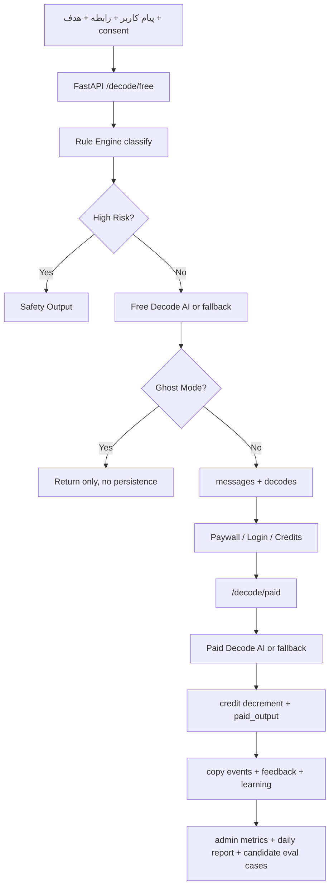

# مستند جامع محصول، فنی و منطق کسب‌وکار Message Decoder

آخرین به‌روزرسانی: 2026-05-24

این سند تصویر یکپارچه‌ای از محصول Message Decoder by NeuroLens تا وضعیت فعلی کدبیس است. هدف آن این است که هر عضو جدید تیم، سرمایه‌گذار، توسعه‌دهنده یا طراح محصول بتواند بفهمد محصول چه مسئله‌ای را حل می‌کند، تجربه کاربر چگونه کار می‌کند، منطق درآمدی و کسب‌وکار چیست، معماری فنی از چه اجزایی ساخته شده و هر تصمیم مهم در کجا پیاده‌سازی شده است.

## 1. خلاصه اجرایی

Message Decoder یک ابزار فارسی‌زبان برای رمزگشایی پیام‌های مبهم، سرد، تند، کنایه‌آمیز، احساسی، کاری یا پرتنش است. کاربر پیام طرف مقابل را وارد می‌کند، نوع رابطه و هدف خودش را انتخاب می‌کند و سیستم قبل از ساختن جواب، پیام را از نظر نیاز پنهان، لنز رفتاری غالب، لحن، ریسک مکالمه و مسیر پاسخ کم‌ریسک‌تر تحلیل می‌کند.

وعده محصول:

> قبل از جواب دادن، بفهم پشت پیامش چیست و جواب کم‌ریسک‌تر بگیر.

محصول به شکل عمدی نقش درمانگر، تشخیص‌دهنده روانشناختی، قاضی نیت قطعی یا ذهن‌خوان را بازی نمی‌کند. خروجی‌ها باید محتاطانه، احتمالی و رفتاری باشند. سه لنز Dopamine، Oxytocin و Serotonin در این محصول فقط زبان استعاری و محصولی برای دسته‌بندی رفتار هستند، نه ادعای زیستی یا پزشکی.

نسخه فعلی یک MVP عملیاتی دارد:

- وب‌اپ فارسی RTL با Next.js.
- API با FastAPI.
- تحلیل رایگان پیام.
- پاسخ کامل پولی با سیستم credit.
- ورود با OTP تستی.
- پرداخت Zarinpal شکل، با sandbox داخلی.
- مخاطبین و حافظه رفتاری ساده.
- تاریخچه opt-in.
- Ghost Mode برای تحلیل بدون ذخیره.
- داشبورد ادمین و metrics.
- rule engine قابل توضیح.
- حلقه یادگیری با feedback، copy events، daily report و candidate eval cases.

## 2. جایگاه محصول

دسته محصول:

- Communication Intelligence
- Relationship Response Assistant
- Self-awareness Tool
- فارسی‌زبان و مناسب مکالمه‌های عاطفی، کاری و خانوادگی

جایگاه اصلی:

> Message Decoder کمک می‌کند قبل از پاسخ دادن، نیاز پنهان، ریسک مکالمه و جواب کم‌ریسک‌تر را بفهمی.

تمایز اصلی با ابزارهای عمومی AI این است که محصول از کاربر نمی‌پرسد «چه جوابی می‌خواهی بدهی؟» بلکه ابتدا می‌گوید «اول بفهمیم پشت پیام چیست.» بنابراین ارزش اولیه در فهمیدن پیام است و ارزش پولی در ساختن جواب قابل ارسال.

## 3. مخاطب هدف

مخاطب اصلی، فارسی‌زبان‌های 18 تا 45 ساله‌اند که در پیام‌های احساسی، کاری یا خانوادگی زیاد overthink می‌کنند و قبل از جواب دادن دنبال فهم بهتر موقعیت هستند.

segmentهای شروع:

- رابطه عاطفی یا dating.
- رابطه تمام‌شده یا نیمه‌تمام با اکس.
- تنش کاری با مدیر، همکار، مشتری یا خریدار.
- خانواده و دوست، به عنوان کاربردهای ثانویه اما پشتیبانی‌شده.

سؤال‌های ذهنی کاربر:

- منظورش واقعا چی بود؟
- الان چی جواب بدهم که دعوا نشود؟
- اگر جواب ندهم بدتر می‌شود؟
- اگر جواب بدهم needy دیده می‌شوم؟
- این پیام بی‌احترامی بود یا من زیادی حساس شدم؟
- باید نرم جواب بدهم یا محکم؟
- چطور حرفه‌ای جواب بدهم بدون اینکه دفاعی به نظر برسم؟

درد کاربر فوری است. پیام را همین الان گرفته و همین الان نیاز به برداشت و پاسخ دارد.

## 4. مدل محصول

جریان اصلی محصول پنج مرحله دارد:

1. فهم پیام.
2. تشخیص لنز غالب.
3. تشخیص ریسک مکالمه.
4. پیشنهاد جهت پاسخ.
5. تولید پاسخ پولی و قابل کپی.

در نتیجه محصول اول Decoder است و بعد Reply Generator. Free layer باید magic moment ایجاد کند، اما copy-ready reply کامل را نمی‌دهد. Paid layer باید خروجی عملی و قابل ارسال بسازد.

## 5. مدل سه‌لنزی

سه لنز محصول به شکل رفتاری تعریف شده‌اند.

### 5.1 لنز هدف و کنترل

کلید فنی: `dopamine`

وقتی فعال می‌شود که پیام حول نتیجه گرفتن، کنترل، پیگیری، عجله، فرصت از دست‌رفته، زمان‌بندی، اقدام مشخص یا مطالبه باشد.

سؤال پنهان:

> چرا چیزی که می‌خواهم جلو نمی‌رود؟

جهت پاسخ بهتر:

- مسئولیت مشخص.
- وضعیت فعلی روشن.
- اقدام بعدی.
- زمان‌بندی دقیق.
- کاهش ابهام.

نمونه کاربرد: پیام مدیر یا مشتری که از تأخیر، پیگیری مکرر یا نبود خروجی مشخص ناراضی است.

### 5.2 لنز امنیت و اعتماد

کلید فنی: `oxytocin`

وقتی فعال می‌شود که پیام حول امنیت عاطفی، اعتماد، نزدیکی، فاصله، وفاداری، دیده‌شدن، ترس از طرد شدن یا نیاز به اطمینان باشد.

سؤال پنهان:

> آیا هنوز برای تو مهمم و می‌توانم به تو اعتماد کنم؟

جهت پاسخ بهتر:

- اول احساس را دیدن.
- روشن کردن نیت.
- پرهیز از سردی و دفاع طولانی.
- دعوت به بیان مستقیم.

نمونه کاربرد: «باشه، معلومه برات مهم نیست.»

### 5.3 لنز شأن و احترام

کلید فنی: `serotonin`

وقتی فعال می‌شود که پیام حول احترام، جایگاه، اعتبار، تحقیر، مقایسه، قضاوت، آبرو یا دیده‌شدن سهم فرد باشد.

سؤال پنهان:

> آیا من دیده شدم، محترم شمرده شدم و جایگاهم حفظ شد؟

جهت پاسخ بهتر:

- برگرداندن احترام.
- پذیرش سهم آسیب.
- مرز بدون تحقیر.
- پرهیز از جنگ برتری.

نمونه کاربرد: پیام‌هایی که در آن‌ها سرزنش، تحقیر، مقایسه یا حساسیت به جایگاه دیده می‌شود.

## 6. قوانین علمی، اخلاقی و حقوقی

محصول نباید ادعای قطعی، پزشکی یا تشخیصی داشته باشد. ممنوعیت‌های مهم:

- نگوییم «اکسی‌توسین طرف پایین است».
- نگوییم «دوپامینش بالاست».
- نگوییم «این آدم narcissist است».
- نگوییم «این پیام ثابت می‌کند قصدش کنترل توست».
- نگوییم «او اختلال دارد».

جایگزین درست:

- «لنز غالب: امنیت و اعتماد».
- «برداشت احتمالی: نیاز به اطمینان یا ترس از بی‌اهمیت شدن».
- «ممکن است این پیام فقط از خستگی، عجله یا سوءتفاهم آمده باشد».
- «از روی یک پیام نمی‌شود درباره شخصیت یا نیت قطعی قضاوت کرد».

این محدودیت در پرامپت اصلی، fallbackهای rule-based و توضیح لنزها تکرار شده است.

## 7. منطق کسب‌وکار

مدل فعلی کسب‌وکار credit-based است.

تحلیل رایگان:

- کاربر می‌تواند پیام را تحلیل کند.
- خروجی شامل لنز، ریسک، نیاز پنهان احتمالی، جهت پاسخ، confidence، alternative read، lens mix و tone stress است.
- پاسخ کامل و قابل کپی در free layer ارائه نمی‌شود.

پاسخ پولی:

- نیاز به ورود با OTP و داشتن credit دارد.
- هر paid decode جدید یک credit مصرف می‌کند.
- اگر paid output قبلا برای همان decode ساخته شده باشد، همان خروجی برگردانده می‌شود و credit دوباره کم نمی‌شود.
- safety decodes وارد مسیر paid reply نمی‌شوند.

بسته‌های اعتباری فعلی:

| package_id | تعداد اعتبار | مبلغ |
| :--- | ---: | ---: |
| `credits_5` | 5 | 49000 |
| `credits_20` | 20 | 169000 |
| `credits_50` | 50 | 349000 |

پرداخت:

- provider فعلی `zarinpal` است.
- اگر `ZARINPAL_MERCHANT_ID` خالی یا `sandbox` باشد، پرداخت sandbox داخلی فعال می‌شود.
- در production، request و verify واقعی Zarinpal از service پرداخت انجام می‌شود.

شاخص‌های بیزینسی موجود در داشبورد:

- تعداد کاربران.
- تعداد free decodes.
- تعداد paid decodes.
- revenue تاییدشده.
- conversion از free به paid.
- copy rate از paid به copy.
- mix لنزها.
- mix safety labelها.

## 8. تجربه کاربر در وب

وب‌اپ در `apps/web` با Next.js ساخته شده و صفحه اصلی تجربه در `apps/web/app/decoder/page.tsx` قرار دارد.

اجزای اصلی تجربه:

- ورودی پیام.
- انتخاب نوع رابطه.
- انتخاب هدف پاسخ.
- context اختیاری.
- انتخاب privacy consent.
- Ghost Mode.
- templateهای آماده برای سناریوهای رایج.
- تحلیل رایگان.
- نمودار/نمایش lens mix و tone stress.
- ورود با شماره و OTP.
- خرید/فعال‌سازی اعتبار.
- ساخت paid reply.
- copy reply و ثبت copy event.
- ارسال feedback.
- مدیریت مخاطبین.
- thermometer رابطه برای هر مخاطب.
- تاریخچه تحلیل‌ها برای پیام‌هایی که کاربر اجازه ذخیره داده است.

انواع رابطه:

- `romantic`: رابطه عاطفی.
- `ex`: اکس یا رابطه تمام‌شده.
- `friend`: دوست یا آشنا.
- `family`: خانواده.
- `manager_colleague`: مدیر یا همکار.
- `customer`: مشتری یا خریدار.
- `unknown`: نامشخص.

اهداف کاربر:

- `calm_conflict`: کم کردن تنش.
- `set_boundary`: مرزبندی محترمانه.
- `improve_relationship`: ترمیم رابطه.
- `professional_reply`: پاسخ حرفه‌ای و کوتاه.
- `make_them_accountable`: شفاف کردن مسئولیت.
- `avoid_needy`: نیازمند یا دفاعی دیده نشدن.
- `end_conversation`: بستن محترمانه مکالمه.
- `understand_only`: فقط فهمیدن پیام.

## 9. معماری فنی کلان

کدبیس اصلی به دو اپ تقسیم شده است:

- `apps/api`: بک‌اند FastAPI و SQLite.
- `apps/web`: فرانت‌اند Next.js.

فایل‌های static build شده وب داخل `apps/api/web_static` هم قرار گرفته‌اند تا API بتواند در deployment یکپارچه، وب را سرو کند.

جریان اصلی داده:



## 10. بک‌اند

نقطه ورود:

- `apps/api/app/main.py`

مسئولیت‌ها:

- ایجاد FastAPI app.
- اجرای `init_db` در lifespan.
- تنظیم CORS.
- ثبت routerها.
- health check.
- سرو static web build در صورت وجود.

Routerها:

- `auth.py`: OTP و session.
- `user.py`: credit و حذف داده ذخیره‌شده.
- `contacts.py`: مخاطبین و relationship thermometer.
- `decode.py`: free/paid decode، history، delete decode.
- `payments.py`: create و verify پرداخت.
- `feedback.py`: feedback، selected reply و copy event.
- `admin.py`: metrics، decode listing، learning، rule engine explain/eval/candidate cases.

## 11. مدل داده و دیتابیس

دیتابیس فعلی SQLite است و از `DATABASE_URL` خوانده می‌شود. مقدار پیش‌فرض:

```text
sqlite:///./message_decoder.db
```

جدول‌های اصلی:

| جدول | نقش |
| :--- | :--- |
| `users` | کاربر، شماره، اعتبار، consent training، کانال ورود |
| `auth_otps` | کدهای OTP |
| `auth_sessions` | session tokenها |
| `messages` | پیام ورودی و metadata رابطه، هدف، consent و safety |
| `decodes` | خروجی free و paid، لنزها، confidence و نسخه‌های مدل/پرامپت |
| `payments` | پرداخت‌ها، بسته، مبلغ، وضعیت، authority و ref_id |
| `feedback` | rating، outcome، regret score، reply منتخب و comment |
| `copy_events` | ثبت کپی شدن جواب‌ها |
| `analytics_events` | eventهای محصولی |
| `quality_signals` | سیگنال‌های یادگیری مشتق از feedback/copy |
| `daily_learning_reports` | گزارش‌های روزانه یادگیری |
| `semantic_cache` | cache پاسخ‌های AI |
| `contacts` | مخاطبین، profile summary و interaction count |

نسخه‌ها در هر decode ذخیره می‌شوند:

- `model_version`
- `free_model_version`
- `paid_model_version`
- `prompt_version`
- `rule_engine_version`
- `output_schema_version`

این کار برای traceability مهم است. اگر کیفیت خروجی تغییر کند، می‌توان فهمید هر خروجی با کدام مدل، پرامپت و rule engine ساخته شده است.

## 12. Rule Engine

Rule Engine در `apps/api/app/services/rule_engine.py` قرار دارد و از کاتالوگ `apps/api/app/services/rule_catalog.py` استفاده می‌کند.

نسخه فعلی:

```text
RULE_ENGINE_VERSION = rule-engine-v0.4
```

خروجی اصلی rule engine یک `Classification` است:

- `safety_label`
- `dominant_lens`
- `secondary_lenses`
- `confidence`
- `manipulative`
- `tones`
- `hidden_need`
- `main_risk`
- `recommended_direction`
- `alternative_interpretation`
- `words_to_avoid`
- `reply_strategy`
- `safety_reasons`
- `evidence_terms`
- `lens_scores`

منطق کار:

1. متن پیام و context نرمال‌سازی می‌شود.
2. safety terms بررسی می‌شوند.
3. toneها match می‌شوند.
4. manipulation terms بررسی می‌شوند.
5. score سه لنز محاسبه می‌شود.
6. بر اساس رابطه، هدف و toneها bias اعمال می‌شود.
7. dominant lens و secondary lenses انتخاب می‌شوند.
8. profile و playbook مرتبط ساخته می‌شود.

نمونه biasها:

- رابطه عاطفی، اکس و خانواده کمی وزن `oxytocin` می‌گیرند.
- مدیر/همکار و مشتری کمی وزن `dopamine` و `serotonin` می‌گیرند.
- هدف `professional_reply` و `make_them_accountable` وزن `dopamine` را بالا می‌برد.
- هدف `end_conversation` وزن `serotonin` را بالا می‌برد.
- tone کنترل‌گر وزن `dopamine` را بالا می‌برد.
- tone تحقیرکننده یا سرزنش‌گر وزن `serotonin` را بالا می‌برد.
- tone گناه‌دهنده یا قربانی‌گونه وزن `oxytocin` را بالا می‌برد.

## 13. AI Service

AI service در `apps/api/app/services/ai.py` قرار دارد.

نسخه‌ها:

```text
PROMPT_VERSION = message-decoder-system-v0.2
MODEL_VERSION = mock-v0.1
OUTPUT_SCHEMA_VERSION = decode-schema-v0.1
```

مسئولیت‌ها:

- نگهداری system prompt فارسی.
- اجرای free decode.
- اجرای paid decode.
- انتخاب مدل free یا paid.
- fallback rule-based در صورت نبود provider یا API key.
- ساخت lens mix و tone stress.
- parse و validate خروجی JSON مدل.
- افزودن reaction prediction برای reply optionها.

Providerهای قابل استفاده:

- `mock`: پیش‌فرض و deterministic.
- `openai`
- `openai_compatible`
- `liara`

مدل‌ها با env جدا می‌شوند:

- `AI_FREE_MODEL`: مدل سریع/ارزان برای تحلیل رایگان.
- `AI_PAID_MODEL`: مدل باکیفیت‌تر برای پاسخ پولی.
- `AI_API_BASE_URL` و `AI_PAID_API_BASE_URL`: base URL جدا برای free و paid.
- `AI_API_KEY` و `AI_PAID_API_KEY`: کلید جدا یا fallback به کلید اصلی.

در fallback فعلی، paid replies برای سه دسته اصلی ساخته می‌شوند:

- کاری/مشتری.
- اکس/پایان مکالمه.
- رابطه عاطفی یا عمومی.

هر paid output شامل گزینه‌هایی مثل نرم، کوتاه، قاطع و آرام، تعیین‌کننده مرز و در صورت نیاز پایان‌دهنده است.

## 14. Free Decode

Endpoint:

```http
POST /decode/free
```

ورودی:

- `message_text`
- `relationship_type`
- `user_goal`
- `optional_context`
- `privacy_consent`
- `contact_id`
- `ghost_mode`

منطق:

1. اگر Authorization موجود باشد، user از session استخراج می‌شود.
2. اگر `contact_id` متعلق به user باشد، `profile_summary` مخاطب به context AI اضافه می‌شود.
3. پیام با rule engine طبقه‌بندی می‌شود.
4. اگر high risk باشد، safety output ساخته می‌شود.
5. اگر normal یا manipulation redirect باشد، free decode ساخته می‌شود.
6. اگر ghost mode خاموش باشد، message و decode ذخیره می‌شوند.
7. اگر contact_id وجود داشته باشد، interaction count افزایش پیدا می‌کند.
8. eventهای analytics ثبت می‌شوند.

خروجی free:

- `dominant_lens`
- `dominant_lens_explanation`
- `why_this_lens`
- `secondary_lenses`
- `lens_mix`
- `tone_stress`
- `likely_underlying_need`
- `conversation_risk`
- `recommended_direction`
- `confidence`
- `alternative_read`
- `privacy_warning`
- `cta`

نکته بیزینسی:

Free decode عمدا `copy_ready_reply` ندارد تا paywall پس از magic moment قرار بگیرد.

## 15. Paid Decode

Endpoint:

```http
POST /decode/paid
```

نیازمندی‌ها:

- Bearer token معتبر.
- وجود decode ذخیره‌شده.
- credit balance حداقل 1.
- free decode نباید safety output باشد.

منطق:

1. decode با message و contact profile پیدا می‌شود.
2. اگر کاربر credit ندارد، 402 برمی‌گردد.
3. اگر paid output قبلا وجود دارد، همان output برگردانده می‌شود.
4. اگر paid output وجود ندارد، paid decode ساخته می‌شود.
5. paid output ذخیره می‌شود.
6. یک credit از حساب کاربر کم می‌شود.
7. event `paid_decode_generated` ثبت می‌شود.

خروجی paid:

- `deep_read`
- `dominant_lens`
- `secondary_lenses`
- `reply_options`
- `words_to_avoid`
- `safe_opening_line`
- `copy_ready_reply`
- `attribution_reply`
- `follow_up_question`

هر `reply_option` شامل:

- `label`
- `text`
- `why_it_works`
- `reaction_prediction`

## 16. Safety Mode

Safety Mode وقتی فعال می‌شود که rule engine نشانه‌های خطر جدی ببیند.

ریسک‌های هدف:

- تهدید فیزیکی.
- خودآسیب‌رسانی.
- اخاذی یا تهدید به افشا.
- stalking یا اجبار شدید.
- تهدید جنسی.
- ریسک حقوقی یا کاری جدی.

در این حالت:

- paid reply ساخته نمی‌شود.
- خروجی کوتاه، مرزدار و ایمنی‌محور است.
- هدف آرام کردن رابطه به هر قیمت نیست.
- سیستم توصیه می‌کند کاربر تنها نماند و در خطر فوری کمک بگیرد.

خروجی safety:

- `warning_title`
- `priority`
- `suggested_reply`
- `recommendation`

## 17. Manipulation Redirect

اگر کاربر خواسته ناسالم داشته باشد، مانند تحریک حسادت، ایجاد احساس گناه، وابسته کردن طرف مقابل یا ساختن پیامی که طرف نتواند نه بگوید، محصول نباید همان درخواست را اجرا کند.

در عوض:

- خواسته را به پیام سالم، قاطع و بالغ تبدیل می‌کند.
- از تحقیر، تهدید، بازی روانی و guilt trip دوری می‌کند.
- مرز و احساس کاربر را واضح بیان می‌کند.

این رفتار در `MANIPULATION_TERMS` و profileهای rule engine پشتیبانی می‌شود.

## 18. حریم خصوصی و consent

سه سطح consent وجود دارد:

| مقدار | رفتار |
| :--- | :--- |
| `none` | متن خام و ناشناس‌شده ذخیره نمی‌شود |
| `anonymized` | فقط نسخه ناشناس‌شده ذخیره می‌شود |
| `history` | متن خام برای تاریخچه کاربر ذخیره می‌شود و نسخه anonymized هم ساخته می‌شود |

قواعد فعلی:

- اگر `privacy_consent = history` باشد، `raw_text` ذخیره می‌شود.
- اگر `privacy_consent` برابر `history` یا `anonymized` باشد، `anonymized_text` ساخته می‌شود.
- تاریخچه کاربر فقط decodeهایی را نشان می‌دهد که consent آن‌ها `history` بوده است.
- admin listing فقط preview ناشناس‌شده را نشان می‌دهد و raw text را برنمی‌گرداند.
- کاربر می‌تواند یک decode یا کل داده ذخیره‌شده خود را حذف کند.

Ghost Mode:

- اگر `ghost_mode = true` باشد، message و decode در دیتابیس ذخیره نمی‌شوند.
- paid decode برای خروجی ghost ممکن نیست، چون decode در دیتابیس وجود ندارد.
- UI به کاربر اعلام می‌کند تحلیل در حالت شبح ذخیره نشده است.

## 19. احراز هویت و اعتبار

ورود با OTP:

```http
POST /auth/request-otp
POST /auth/verify-otp
```

در حالت mock، OTP از `DEV_OTP_CODE` خوانده می‌شود. مقدار فعلی پیش‌فرض:

```text
25367286503
```

منطق verify:

- کد فارسی به انگلیسی نرمال می‌شود.
- اگر کد با OTP ذخیره‌شده یا کد bypass فعلی برابر باشد، ورود موفق است.
- اگر user وجود نداشته باشد ساخته می‌شود.
- در وضعیت فعلی، هر verify موفق یک credit به کاربر می‌دهد.
- session token ساخته و در `auth_sessions` ذخیره می‌شود.

این رفتار برای MVP و تست مناسب است، اما در production باید سیاست credit-on-login، انقضای OTP، محدودیت نرخ و SMS provider واقعی بازبینی شود.

## 20. مخاطبین و حافظه رابطه‌ای

مخاطبین در `contacts.py` پیاده‌سازی شده‌اند.

قابلیت‌ها:

- ساخت مخاطب.
- ویرایش مخاطب.
- حذف مخاطب.
- لیست مخاطبین بر اساس interaction count.
- اتصال decode به contact.
- افزودن profile summary مخاطب به context AI.
- relationship thermometer.

فیلدهای مخاطب:

- `name`
- `relationship_type`
- `default_goal`
- `profile_summary`
- `interaction_count`

وقتی کاربر paid reply انتخاب‌شده را با `/feedback/selected-reply` ثبت می‌کند، سیستم یک جمله کوتاه درباره reply label و outcome به `profile_summary` مخاطب اضافه می‌کند. این حافظه ساده، پایه lock-in محصول است: هرچه کاربر از محصول برای یک مخاطب بیشتر استفاده کند، context رابطه‌ای بیشتری ساخته می‌شود.

## 21. Relationship Thermometer

Endpoint:

```http
GET /contacts/{contact_id}/thermometer
```

منطق فعلی:

- آخرین 20 decode مخاطب خوانده می‌شود.
- اگر dominant lens `serotonin` باشد، defensive trend بیشتر و warmth کمتر می‌شود.
- اگر `dopamine` باشد، کمی defensive trend بیشتر می‌شود.
- اگر `oxytocin` باشد، defensive trend کمتر و warmth بیشتر می‌شود.
- safety labelهای watch و high_risk امتیاز ریسک را بالا می‌برند.

خروجی:

- `interaction_count`
- `defensive_trend`
- `warmth_score`
- `label`
- `summary`

این feature فعلا heuristic است، نه تحلیل علمی قطعی. هدف آن دادن حس روند رابطه و افزایش چسبندگی محصول است.

## 22. Feedback، Copy Events و Learning

مسیرهای feedback:

```http
POST /feedback
POST /feedback/selected-reply
POST /copy-event
```

سیگنال‌های جمع‌آوری‌شده:

- rating کاربر.
- reply label محبوب.
- آیا پاسخ کپی شد.
- آیا پاسخ ارسال شد.
- outcome.
- regret score.
- comment کاربر.
- selected reply label.

این سیگنال‌ها در `quality_signals` هم ثبت می‌شوند تا برای گزارش روزانه و انتخاب eval case استفاده شوند.

Daily learning report:

```http
GET /admin/learning/daily
```

متریک‌های report:

- total decodes.
- paid decodes.
- copied paid decodes.
- copy rate.
- feedback count.
- positive feedback rate.
- negative feedback rate.
- average regret score.
- lens mix.
- safety mix.
- model mix.

نمونه recommendationها:

- داده کم است، فعلا فقط مشاهده کن.
- copy rate پایین است، reply options و labelها را بازبینی کن.
- feedback کم است، سؤال یک‌کلیکی اضافه کن.
- negative feedback بالاست، نمونه‌های بد را وارد eval set کن.
- regret score بالاست، پاسخ‌ها احتمالا بیش از حد تند، طولانی یا مطمئن‌اند.

## 23. ادمین و کنترل کیفیت

ادمین با header زیر محافظت می‌شود:

```http
X-Admin-Token: <ADMIN_TOKEN>
```

Endpointهای مهم:

- `GET /admin/metrics`
- `GET /admin/decodes`
- `GET /admin/learning/daily`
- `POST /admin/rule-engine/explain`
- `GET /admin/rule-engine/eval`
- `GET /admin/rule-engine/candidate-cases`

کاربردها:

- دیدن سلامت funnel.
- بررسی conversion و copy rate.
- فیلتر decodeها بر اساس رابطه، لنز، safety و prompt version.
- توضیح اینکه rule engine چرا یک lens یا tone را انتخاب کرده است.
- اجرای eval suite.
- استخراج candidate cases از feedback منفی یا مشکوک.

## 24. Evaluation و تست

تست‌های backend در `apps/api/tests` قرار دارند.

پوشش فعلی شامل:

- free decode بدون copy-ready reply.
- lens mix و tone stress.
- ghost mode و عدم persistence.
- paid decode برای ghost decode.
- contact interaction count.
- admin listing با anonymization.
- تاریخچه opt-in.
- حذف داده ذخیره‌شده.
- rule engine برای tone، need و strategy.
- fallback paid replies.
- نرمال‌سازی فارسی.
- precision safety.
- playbookهای dynamic.
- AI model/provider behavior.
- learning و generated eval cases.

Evaluation rule engine:

- در `apps/api/app/services/rule_eval.py`.
- از endpoint ادمین قابل اجراست.
- متریک‌ها شامل lens accuracy، safety accuracy، tone recall، lens confusion، misses و recommendations هستند.

اصل مهم:

افزایش تعداد ruleها بدون eval خطرناک است. هر سیگنال جدید باید یا accuracy را بهتر کند، یا safety miss را کم کند، یا پاسخ‌ها را کاربردی‌تر کند.

## 25. فرانت‌اند

فرانت در `apps/web` است.

فایل‌های مهم:

- `apps/web/app/decoder/page.tsx`: صفحه اصلی محصول.
- `apps/web/app/admin/page.tsx`: صفحه ادمین.
- `apps/web/app/payment/callback/page.tsx`: callback پرداخت.
- `apps/web/lib/api.ts`: client API typed.
- `apps/web/app/styles.css`: استایل کلی.

API URL:

- از `NEXT_PUBLIC_API_URL` خوانده می‌شود.
- در localhost، پیش‌فرض `http://127.0.0.1:8000` است.
- در محیط غیرلوکال، مسیر نسبی استفاده می‌شود تا API و static web روی یک host کار کنند.

UI فعلی از iconهای `lucide-react` استفاده می‌کند و RTL فارسی است. بخش decoder تجربه کامل محصول را به عنوان first screen ارائه می‌دهد و landing page جداگانه نیست.

## 26. Deployment

فایل‌های مرتبط:

- `Dockerfile`
- `liara.json`
- `liara_nodisk.json`
- `apps/api/Dockerfile`
- `apps/api/liara.json`
- `apps/api/Procfile`
- `apps/web/Dockerfile`
- `apps/web/liara.json`
- `vercel.json`
- `.vercelignore`
- `DEPLOYMENT.md`

الگوی deployment فعلی از Liara پشتیبانی می‌کند. API می‌تواند static build وب را از `web_static` سرو کند؛ این یعنی امکان deployment یکپارچه API + web وجود دارد.

الگوی دوم برای production frontend هم آماده است: وب به صورت static export روی Vercel build می‌شود و از طریق `NEXT_PUBLIC_API_URL` به API روی Liara وصل می‌ماند. در این حالت باید دامنه Vercel در `CORS_ORIGINS` بک‌اند Liara و `ZARINPAL_CALLBACK_URL` ثبت شود.

متغیرهای محیطی مهم:

| نام | کاربرد |
| :--- | :--- |
| `DATABASE_URL` | مسیر دیتابیس |
| `AI_PROVIDER` | mock/openai/openai_compatible/liara |
| `AI_API_BASE_URL` | base URL مدل free |
| `AI_PAID_API_BASE_URL` | base URL مدل paid |
| `AI_API_KEY` | API key اصلی |
| `AI_PAID_API_KEY` | API key paid، اختیاری |
| `AI_MODEL` | مدل پیش‌فرض |
| `AI_FREE_MODEL` | مدل free |
| `AI_PAID_MODEL` | مدل paid |
| `AI_FREE_TEMPERATURE` | temperature تحلیل رایگان |
| `AI_PAID_TEMPERATURE` | temperature paid |
| `AI_FREQUENCY_PENALTY` | کاهش تکرار |
| `AI_SEMANTIC_CACHE_ENABLED` | روشن/خاموش بودن cache |
| `OTP_PROVIDER` | provider OTP |
| `DEV_OTP_CODE` | کد تست |
| `SMSIR_API_KEY` | کلید API سرویس sms.ir |
| `SMSIR_METHOD` | حالت ارسال sms.ir: auto، verify یا bulk |
| `SMSIR_TEMPLATE_ID` | شناسه قالب تایید sms.ir |
| `SMSIR_PARAMETER_NAME` | نام پارامتر کد در قالب sms.ir |
| `SMSIR_LINE_NUMBER` | خط ارسال برای حالت bulk |
| `SMSIR_MESSAGE_TEMPLATE` | متن پیامک OTP در حالت bulk |
| `ADMIN_TOKEN` | توکن ادمین |
| `ZARINPAL_MERCHANT_ID` | merchant id |
| `ZARINPAL_CALLBACK_URL` | callback پرداخت |
| `CORS_ORIGINS` | originهای مجاز |

## 27. وضعیت فعلی محصول

چیزهایی که تا اینجا پیاده‌سازی شده‌اند:

- MVP web + API.
- تحلیل رایگان با rule engine و fallback AI.
- paid decode با credit.
- auth تستی OTP.
- sandbox/real-shaped payment با Zarinpal.
- privacy consent.
- Ghost Mode.
- مخاطبین.
- profile summary مخاطب در context.
- relationship thermometer.
- history opt-in.
- حذف داده کاربر.
- feedback و copy events.
- daily learning report.
- admin metrics و decode list.
- rule engine explain و eval.
- نسخه‌گذاری prompt/model/rule/schema.
- semantic cache table و service cache.
- تست‌های backend برای بخش‌های اصلی.

چیزهایی که در اسناد استراتژیک آمده اما هنوز محصول کامل production آن‌ها نیست:

- ربات تلگرام.
- اکستنشن Chrome.
- کیبورد اختصاصی موبایل.
- Playbook Hub.
- چالش‌های ارتباطی روزانه.
- RAG واقعی روی مثال‌های موفق.
- fine-tune.
- SMS/OTP production grade.
- billing production grade با همه edge caseها.
- policy کامل retention و حذف خودکار داده.
- داشبورد تحلیلی پیشرفته برای cohorts و funnel.

## 28. ریسک‌ها و بدهی‌های مهم

ریسک‌های محصولی:

- اگر free layer بیش از حد کامل باشد، انگیزه خرید کم می‌شود.
- اگر paid replies شبیه هم باشند، ارزش پولی کم می‌شود.
- اگر محصول بیش از حد قطعی حرف بزند، اعتماد و safety پایین می‌آید.
- اگر safety miss اتفاق بیفتد، ریسک برند و کاربر بالاست.
- اگر privacy شفاف نباشد، کاربر از وارد کردن پیام واقعی می‌ترسد.

ریسک‌های فنی:

- SQLite برای MVP کافی است، اما برای scale و concurrency production بهتر است PostgreSQL بررسی شود.
- OTP فعلی برای تست است و rate limit/expiry production ندارد.
- هر verify موفق فعلا credit اضافه می‌کند؛ برای production باید تغییر کند.
- rule catalog ممکن است با رشد سریع تبدیل به انبار عبارت شود، مگر با eval کنترل شود.
- Ghost Mode paid flow عمدا ممکن نیست، اما UX باید این محدودیت را خیلی شفاف نشان دهد.
- Admin token ساده است و برای production باید auth/role بهتر داشته باشد.

ریسک‌های AI:

- provider ممکن است JSON نامعتبر برگرداند.
- مدل ممکن است قطعیت روانشناختی تولید کند.
- مدل ممکن است در سناریوهای manipulative خواسته ناسالم کاربر را اجرا کند.
- بدون eval انسانی، feedback منفی به تنهایی حقیقت محسوب نمی‌شود.

## 29. نقشه راه پیشنهادی

فاز 1: محکم کردن MVP

- production OTP.
- تکمیل payment callback و وضعیت‌های شکست/لغو.
- retention policy و data deletion کامل‌تر.
- بهبود UX paywall.
- گزارش دقیق funnel.
- افزایش eval cases واقعی.
- تست کامل‌تر safety.

فاز 2: افزایش کیفیت paid

- RAG کوچک روی playbookهای موفق.
- مثال‌های موفق consentدار.
- LLM judge برای rubric کیفیت.
- reply variants بیشتر بر اساس رابطه و هدف.
- A/B تست prompt paid.
- بهبود reaction prediction.

فاز 3: حافظه رابطه‌ای

- profile summary ساختاریافته‌تر.
- timeline مخاطب.
- trendهای دقیق‌تر رابطه.
- preference learning برای سبک پاسخ کاربر.
- نمایش history قابل جست‌وجو.

فاز 4: کانال‌های کم‌اصطکاک

- Telegram bot.
- Chrome extension برای ایمیل/لینکدین/Slack.
- mobile shortcut یا keyboard در بلندمدت.

فاز 5: آموزش و retention

- Playbook Hub.
- سناریوهای آموزشی.
- challengeهای کوتاه ارتباطی.
- پیشنهاد proactive بر اساس history و مخاطب.

## 30. راه‌اندازی محلی

API:

```bash
cd apps/api
python3 -m venv .venv
source .venv/bin/activate
pip install -r requirements.txt
uvicorn app.main:app --reload
```

وب:

```bash
cd apps/web
npm install
npm run dev
```

آدرس‌ها:

- API docs: `http://127.0.0.1:8000/docs`
- Web app: `http://localhost:3000`

اجرای تست backend:

```bash
cd apps/api
pytest
```

Build وب از root:

```bash
npm run build:web
```

## 31. واژه‌نامه سریع

| اصطلاح | معنی |
| :--- | :--- |
| Free Decode | تحلیل رایگان پیام بدون جواب کامل قابل کپی |
| Paid Decode | خروجی پولی شامل چند reply option و copy-ready reply |
| Lens | لنز رفتاری برای خواندن پیام، نه تشخیص زیستی |
| Tone Stress | برچسب و شدت لحن پیام |
| Lens Mix | درصد تقریبی سهم سه لنز |
| Safety Mode | مسیر امن برای پیام‌های پرخطر |
| Manipulation Redirect | تبدیل درخواست ناسالم کاربر به پاسخ سالم و مرزدار |
| Ghost Mode | تحلیل بدون ذخیره message و decode |
| Contact Memory | profile summary و history ساده برای یک مخاطب |
| Relationship Thermometer | شاخص heuristic برای روند رابطه با مخاطب |
| Quality Signal | سیگنال یادگیری از feedback یا copy |
| Candidate Eval Case | نمونه پیشنهادی برای اضافه شدن به eval پس از review انسانی |

## 32. اصل راهبری محصول

Message Decoder باید سه تعادل را همیشه حفظ کند:

1. حس جادویی بدهد، اما ادعای قطعی نکند.
2. جواب کاربردی و قابل ارسال بدهد، اما manipulation تولید نکند.
3. از داده رابطه‌ای ارزش بسازد، اما privacy و اختیار کاربر را جلوتر از رشد محصول نگه دارد.

اگر تصمیمی بین رشد کوتاه‌مدت و اعتماد بلندمدت گیر کرد، برای این محصول اعتماد بلندمدت مهم‌تر است.
